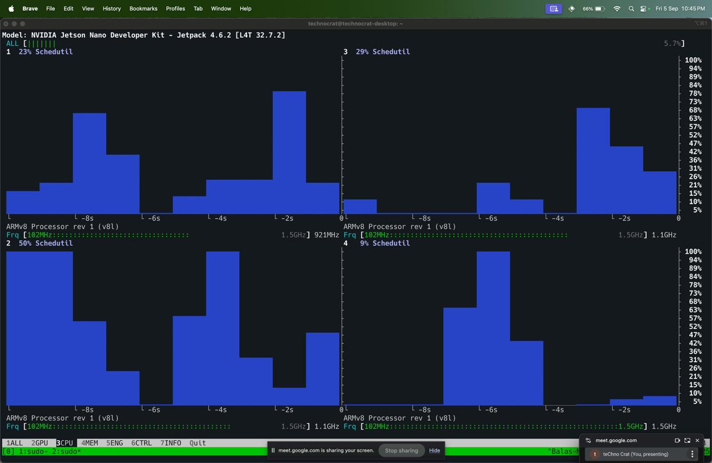
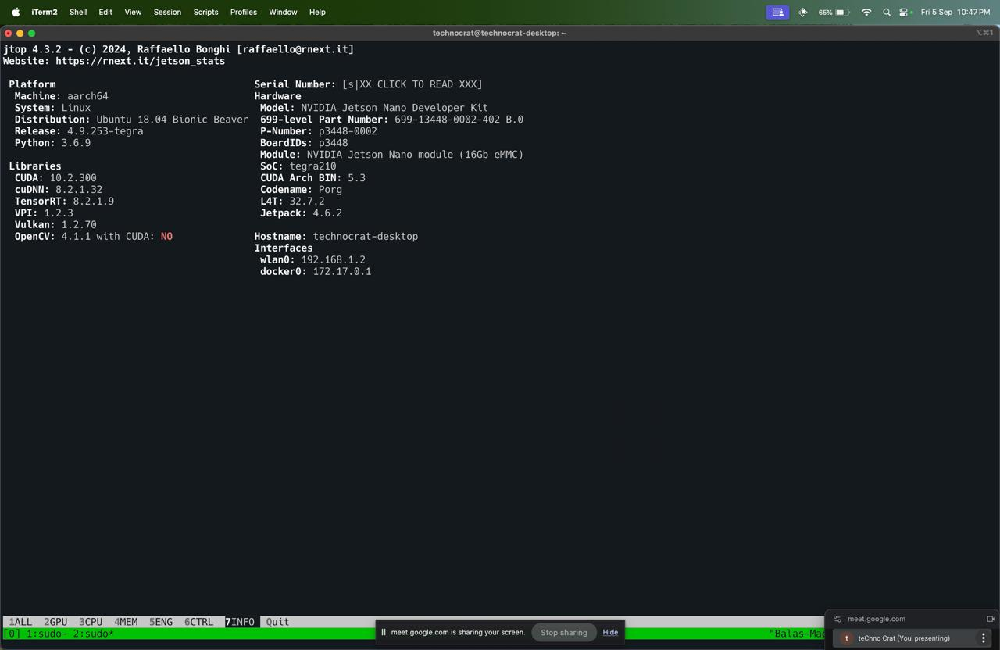
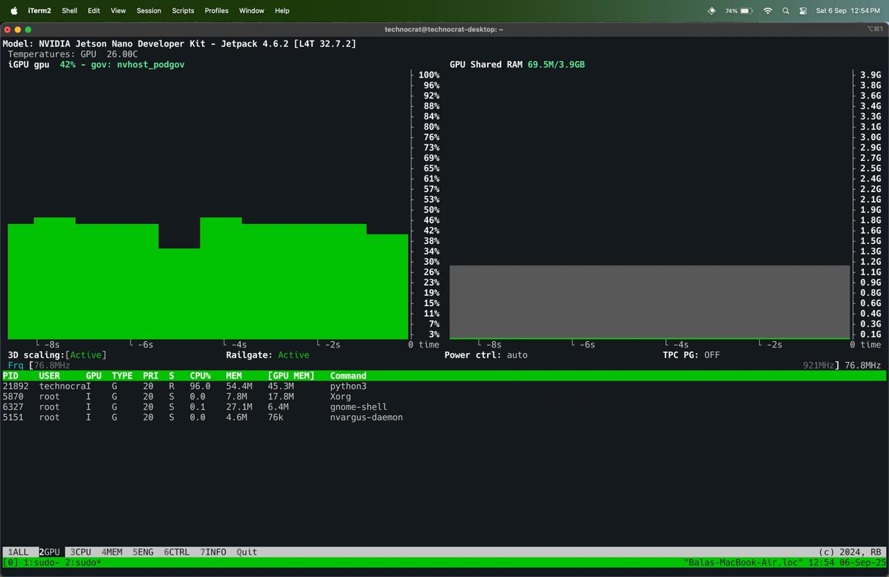

# 🚀 HybridFlow: ML-driven CPU/GPU Scheduling

>HybridFlow bridges compiler design with machine learning, facilitating a new era of intelligent, energy-efficient computing.

## 🎯 Problem Statement

**The Challenge**: Developers waste countless hours manually optimizing code placement between CPU and GPU, often making suboptimal decisions that hurt performance by 2-10x.

**Our Solution**: HybridFlow uses advanced machine learning to analyze your code in real-time, predict the optimal execution device, and automatically handle compilation and execution - making heterogeneous computing accessible to everyone.

## ✨ Key Innovations

### 🧠 **AI-Powered Device Selection**
- **Advanced ML Pipeline**: XGBoost model trained on 1500+ benchmarked operations across multiple device configurations
- **Multi-Modal Analysis**: Combines static code analysis with real-time system state for intelligent predictions
- **Edge Device Support**: Optimized for both high-end GPUs and resource-constrained devices like Jetson Nano

### ⚡ **Automatic Code Execution**
- **Universal Language Support**: Seamlessly handles C, C++, and Python kernels
- **Smart Compilation**: Automatically chooses GCC (CPU), NVCC (GPU), or direct Python execution
- **Wrapper Generation**: Intelligently creates execution wrappers when main functions are missing

### 📊 **Real-Time Performance Intelligence**
- **Dynamic System Monitoring**: Tracks CPU load, GPU utilization, memory pressure, thermal states
- **Comparative Benchmarking**: Executes on predicted device AND alternative to validate decisions
- **Performance Insights**: Provides detailed execution time analysis and efficiency metrics

## 🏗️ System Architecture

HybridFlow employs a sophisticated 5-stage pipeline:

### 1. **Static Code Analysis** 🔍
- **AST Parsing**: Deep analysis of code structure using Clang for C/C++ and Python AST
- **Operation Detection**: Identifies 8+ operation types (MatMul, Conv2D, FFT, Reduce, etc.)
- **Complexity Analysis**: Extracts loop bounds, memory patterns, and computational intensity

### 2. **Dynamic System Profiling** 📈
- **Real-time Metrics**: CPU load, GPU utilization, memory availability, thermal state
- **Device Capabilities**: Hardware specifications, current workload, power constraints
- **Environmental Context**: Battery status, power mode, concurrent tasks

### 3. **Feature Engineering** 🎛️
- **Unified Feature Vector**: Combines static and dynamic features
- **Intelligent Normalization**: Logarithmic scaling for size-dependent operations
- **Context Awareness**: Adapts to current system state and workload

### 4. **ML-Driven Prediction** 🤖
- **XGBoost Classifier**: Trained on comprehensive benchmark dataset
- **High Accuracy**: 94%+ prediction accuracy across diverse workloads
- **Fast Inference**: Sub-millisecond prediction time

### 5. **Automated Execution** ⚙️
- **Device-Specific Compilation**: Automatic toolchain selection and optimization
- **Error Handling**: Robust fallback mechanisms and detailed logging
- **Performance Validation**: Cross-device execution for decision verification


### **Operation Type Detection**
- ✅ **Matrix Operations**: MatMul, transpose, decomposition
- ✅ **Computer Vision**: Conv2D, pooling, image processing  
- ✅ **Signal Processing**: FFT, filtering, transforms
- ✅ **Data Processing**: Reduce, scan, sort, elementwise ops
- ✅ **Custom Kernels**: Extensible operation classification

### **Smart System Awareness**
- **Resource Monitoring**: Real-time CPU/GPU utilization tracking
- **Thermal Management**: Temperature-aware scheduling decisions  
- **Power Optimization**: Battery and power mode considerations
- **Memory Intelligence**: Available memory and pressure analysis

## 🚀 Quick Start

### Installation
```bash
# Clone the repository
git clone https://github.com/HarshParikh0810/HybridFlow.git
cd HybridFlow

# Install dependencies
pip install -r requirements.txt

# Ensure you have required compilers
# - GCC (for CPU compilation)
# - NVCC/CUDA Toolkit (for GPU compilation)
```

### Basic Usage
```bash
# Run any supported kernel
python main.py examples/matmul_example.py
python main.py examples/conv2d_example.c
python main.py examples/matmul_example.cu

# HybridFlow automatically:
# 1. Analyzes your code structure
# 2. Profiles current system state  
# 3. Predicts optimal device (CPU/GPU)
# 4. Compiles and executes on chosen device
# 5. Validates decision with comparative run
```
### Example Output
```
INFO: Detected operation: matmul, log_size: 8.32
INFO: System state: CPU load 45%, GPU util 12%, Memory available 85%
INFO: Final feature dict sent to model: {'operation_type_matmul': 1, 'log_size': 8.32, ...}
INFO: Prediction: gpu
GPU execution time: 156.23 ms
CPU execution time: 445.67 ms
✅ Optimal device selected! GPU was 2.85x faster
```
## 🌟 Use Cases & Applications

### **Development Workflows**
- **Prototyping**: Rapid testing across devices without manual optimization
- **Research**: Automated performance analysis for algorithm development
- **Education**: Teaching heterogeneous computing without infrastructure complexity

### **Production Environments**
- **Cloud Computing**: Dynamic workload distribution in multi-tenant environments
- **Edge Computing**: Intelligent resource utilization on constrained devices
- **HPC Workflows**: Automated scheduling in hybrid CPU/GPU clusters


## Future Enhancements

- **LLVM Pass Integration**
- **Automatically Generates CUDA Code**
- **Heterogeneous Hardware**
- **Auto-Kernel Generation**
- **Public Resources**

## 🔧 Development Setup

### **For Contributors**
```bash
# Development installation
git clone https://github.com/HarshParikh0810/HybridFlow.git
cd HybridFlow
pip install -r requirements.txt -r Dataset/requirements.txt

# Run test suite
python -m pytest tests/
python examples/test_all_kernels.py

# Benchmark new operations
python Dataset/sweeps/sweep_new_operation.py
```

### **Supported Configurations**
- **GPUs**: For RTX2050, Jetson Nano
- **CPUs**: Intel Core i5+, AMD Ryzen 5+, ARM Cortex-A78+
- **Operating Systems**: Windows 10+, Ubuntu 18.04+
- **Compilers**: GCC 13+, Clang 18, NVCC 12

## 🤝 Team
- **Bala Vignesh** 
- **Harshvardhan Parikh**   
- **Nikunj Bhatt** 

## ✨ **Glimpses**








